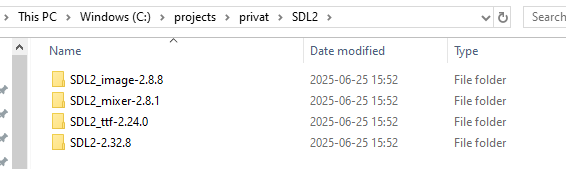

<!-- # Heaven-Hell
My first attempt at creating a C++ game from scratch
-----------------------------------------------------
In this game you control two players, an angel and the devil. 
The objective of the game is to get both players to their respective goals/gates.
The catch is that the angel and devil are controlled by the same keys on the keyboard.
Get both to their goals without them getting stuck or dying. -->

# Heaven-Hell
This version of the game is a top-down RPG 
-----------------------------------------------------
Here you play as a XXX who is in charge of deciding who gets to go to heaven and who goes to hell (Skärselden)
You dont know you origins and it is a mystery. There has been a greate battle and the starting area is in ruins.
Your quest is to find out about you origin/backstory.

Add trees, chop down a tree leaving a tree stump, cast a spell/potion on the tree stump to turn it into a rooter!
Spells primaraly deal damage and Potions primaraly inflict status effects.

Add the ability climb trees to see further

# Developer Setup
Install MSYS2 installer (C++ compiler) by clicking the link: https://github.com/msys2/msys2-installer/releases/download/2024-12-08/msys2-x86_64-20241208.exe. Make sure the compiler is installed at this location: "C:/msys64/ucrt64/bin/gcc.exe", otherwise c_cpp_properties.json needs to be adjusted. 

General Visual Studio Code setup guide can be found here: https://code.visualstudio.com/docs/cpp/config-mingw

Install CMake (Windows x64 Installer): https://cmake.org/download/

Download and extract relevant SDL2 dependancies to sibling folder named "SDL2" and extract VC download inside.

## SDL2 Downloads

| SDL version            | File to download | Link |
|------------------------|:----------------:|:------------------:|
| SDL2              | SDL2-devel-2.32.8-VC.zip  | https://github.com/libsdl-org/SDL/releases       |
| SDL2_image    | SDL2_image-devel-2.8.8-VC.zip     | https://github.com/libsdl-org/SDL_image/releases  |
| SDL2_ttf         | SDL2_ttf-devel-2.24.0-VC.zip      | https://github.com/libsdl-org/SDL_ttf/releases       |
| SDL2_mixer              | SDL2_mixer-devel-2.8.1-VC.zip      | https://github.com/libsdl-org/SDL_mixer/releases  |

The SDL2 folder should look like this.



When the sibling SDL2 folder is done, open the terminal in VSCode and then, inside the root directory of the repository run these commands:

```sh
mkdir build
```

this creates the build folder that CMake will use to build the project. Then initilize the build using the CMake commande:
```sh
cmake -S .   -B build/
```

Then select configuration inside of VSCode and press F5 to do an initial build/compile and then run the game.

To manually compile either the release or debug versions, run these commands:
```sh
cmake --build build --config release
```
```sh
cmake --build build --config debug
```